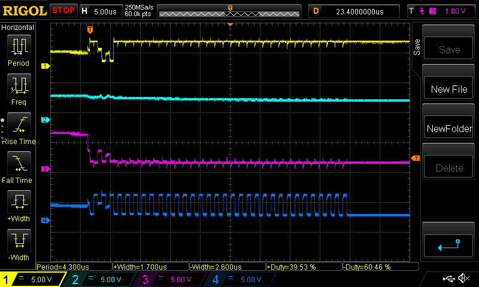
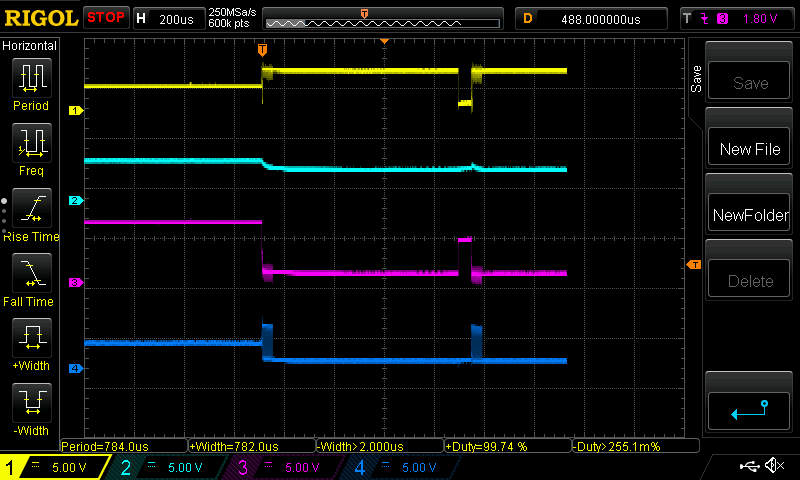
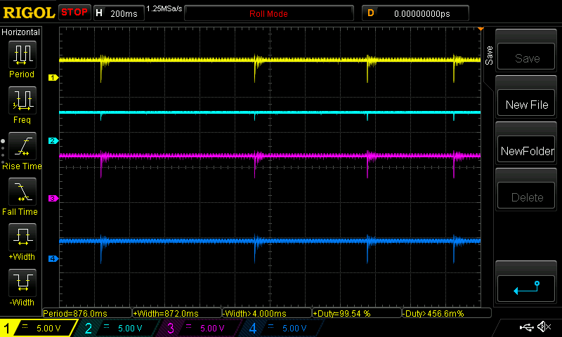

# ice40_devboard
a devboard im working on. spi is causing all kinds of issues though. I'll add the rest of the kicad and source files if I ever get this working.

note that in the schematic, I made the followign changes:
-R2 is connected to +3.3v and not ground, as the AP7347DQ voltage regulator needs a high signal to turn on
-I put a ceramic disc capacitor near the spi rom just to see if that improved anything, it really didnt

from top to bottom: sdi, sdo, ss, sck

close up during an attempt at spi programming:

zoomed out during an attempt at spi programming:

the system is powered on and not doing anything

